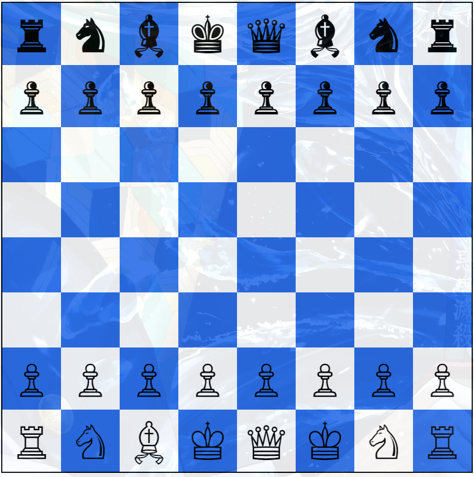

# Chess-Board-Layout
A static chess board layout built with HTML, CSS, and JavaScript, designed as the foundation for a future interactive chess game. Currently, this project includes the visual chessboard with pieces but lacks gameplay functionality—coming soon!

